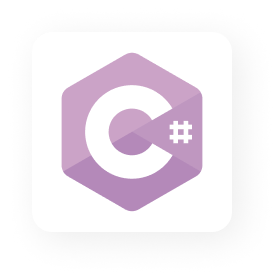
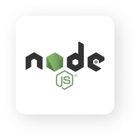
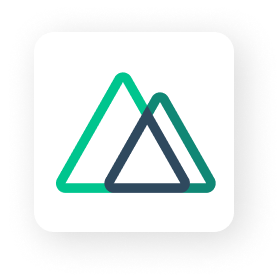
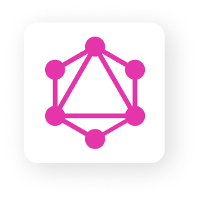
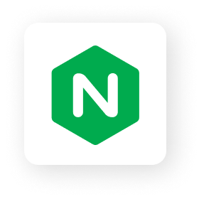

## Hi there 

I'm Evald Smalyakov, a full-stack web developer and software engineer. I am also an open source enthusiast and maintainer. Lately I've been more busy developing microservices and tools on Golang. I have a lot of experience in developing architectural solutions from scratch and a lot of projects.

## My stats

  

  

  

## My personal open source projects

  
  

## Skills

Only what I have been working with for a long time (more than a year) and there are projects made. Darkened something that has not been used for more than a year

### Languages

  
  
  
  
  

### JavaScript Frameworks and tools

  
  
  
  
  
  
  
  

### RPC / APIs

  
  
  

### Database

  
  
  
  
  

### Message Brokers

  
  

### Linux OS

  
  
  
  

### Other

  
  
  
  
  
  
  
  
  

And many other small tools that I did not mention

  

